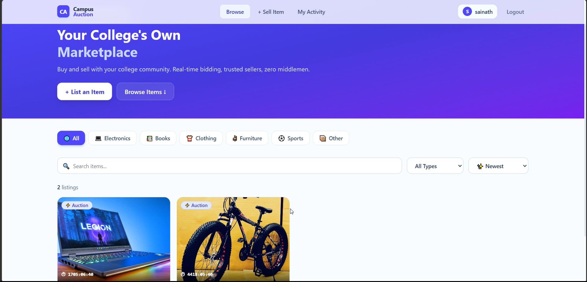
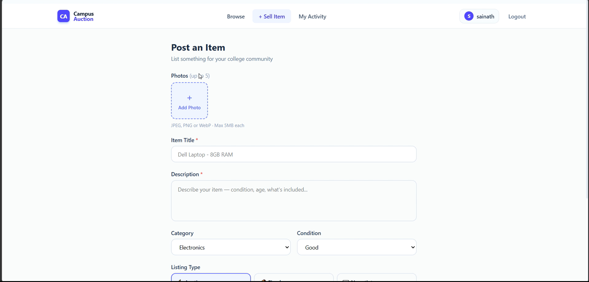
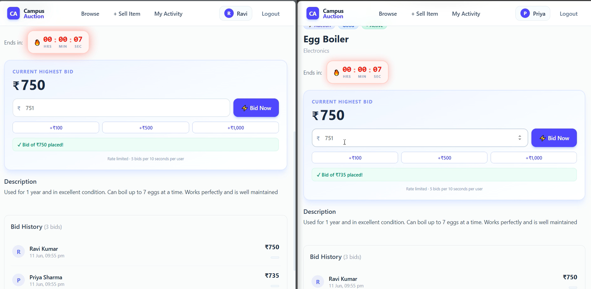

# 🏫 CampusBid — Real-time College Marketplace

A full-stack auction platform built for college communities where students can create listings, place live bids, receive instant updates, and automatically close auctions in real time.

Built using React, Node.js, MySQL, MongoDB, Redis, Socket.io, BullMQ
 
---
## 📸 Screenshots

### Home Page



### Create Listing



### Auction Details




## ✨ Features

- **Real-time bidding** — bids appear instantly across all connected browsers, no refresh needed
- **Auction scheduling** — sellers set an end time; the auction closes automatically
- **Winner notifications** — buyer and seller both receive email confirmations on close
- **Secure auth** — JWT stored in httpOnly cookies with server-side token invalidation on logout
- **Image uploads** — listings support multiple photos via Cloudinary CDN
- **Rate limiting** — prevents bid spam per user per listing
 
---

## 🛠 Tech Stack

| Layer | Technology |
|---|---|
| Frontend | React 18 + Vite |
| Styling | Tailwind CSS v4 |
| Backend | Node.js + Express |
| Primary DB | MySQL 8 |
| Catalog DB | MongoDB |
| Cache | Redis |
| Real-time | Socket.io |
| Job Queue | BullMQ |
| Image Storage | Cloudinary |
| Auth | JWT + bcrypt |
| Containerisation | Docker Compose |

---

## 🏗 Architecture Overview

The app uses two databases for different concerns:

- **MySQL** handles all transactional data — users, bids, auction state. Bids require strong consistency guarantees, so MySQL's ACID transactions are used here.
- **MongoDB** handles catalog data — listing titles, descriptions, images, and category-specific fields (e.g. a laptop listing has RAM/storage fields; a book has author/edition). A flexible schema fits this naturally.
- **Redis** is used for caching, rate limiting, and real-time event delivery.
- **BullMQ** schedules auction close jobs. When a seller sets an end time, a delayed job fires at exactly that time to close the auction and trigger notifications.

```
MongoDB   →  listing metadata, images, custom fields
MySQL     →  users, bids, auction state (single source of truth)
Redis     →  bid cache, rate limiting, pub/sub, token blacklist
BullMQ    →  auction close jobs, email retry jobs
```

---

## 🗄 Database Schema

### MySQL

```sql
users           id, name, email, password_hash, is_deleted
auction_state   listing_id (PK), seller_id, current_price, highest_bidder_id, status, end_time
bids            id, listing_id, bidder_id, amount, created_at
watchlist       user_id, listing_id  (composite PK)
```

### MongoDB

```js
listings {
  seller_id, title, description, category,
  images[], condition, starting_price, buy_now_price,
  custom_fields {}   // flexible per category
}
```

---

## 📁 Project Structure

```
auction-app/
├── docker-compose.yml
├── backend/
│   └── src/
│       ├── config/          # mysql.js, mongo.js, redis.js
│       ├── models/          # MySQL schema, Mongoose Listing model
│       ├── controllers/     # auth, listing, bid
│       ├── middleware/      # auth, rateLimiter, upload
│       ├── routes/
│       ├── socket/          # Socket.io + Redis subscriber
│       ├── queues/          # auctionQueue, emailQueue
│       ├── workers/         # auctionWorker
│       └── utils/           # email (Nodemailer)
└── frontend/
    └── src/
        ├── context/         # AuthContext
        ├── hooks/           # useSocket, useCountdown
        ├── services/        # api, authService, listingService, bidService
        ├── components/      # Navbar, BidBox, BidHistory, CountdownTimer, ListingCard
        └── pages/           # Home, ListingDetail, CreateListing, Profile, Auth
```

---

## 🏃 Running Locally

**Prerequisites:** Node.js 18+, Docker Desktop

```bash
# 1. Clone
git clone https://github.com/yourusername/campus-auction.git
cd campus-auction

# 2. Start databases
docker-compose up -d

# 3. Backend
cd backend
cp .env.example .env   # fill in your values
npm install
npm run dev            # http://localhost:5000

# 4. Frontend (new terminal)
cd frontend
npm install
npm run dev            # http://localhost:5173
```

**Environment variables required:**
```
MYSQL_HOST, MYSQL_PORT, MYSQL_USER, MYSQL_PASSWORD, MYSQL_DATABASE
MONGO_URI
REDIS_HOST, REDIS_PORT
JWT_SECRET
CLOUDINARY_CLOUD_NAME, CLOUDINARY_API_KEY, CLOUDINARY_API_SECRET
EMAIL_USER, EMAIL_PASS
CLIENT_URL
```

> **Quick demo:** Register two accounts in separate browser windows, create an auction, and watch bids sync in real time across both screens.

---

